# Foundation — guide

**Infrastructure for research and cross-disciplinary knowledge work.** You
create agents specialized on your domains, wire them into projects, connect
them to the outside world through transports, and share expertise through Git
— all locally, under your control over your data and your model provider.

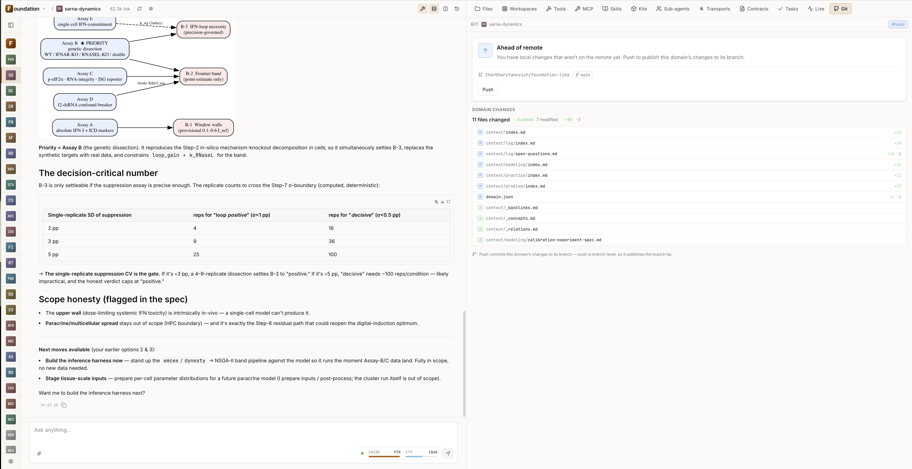

*The main web UI after `found web` — the domain rail (foundation, research,
aristotle + your own), a live chat in the center, and a domain's Git panel with
its DCC files (`_concepts.md`, `_relations.md`, `_backlinks.md`) on the right.*

## Contents

1. [Installation and first run](#1-installation-and-first-run)
2. [Try it in a minute: talk to Aristotle](#2-try-it-in-a-minute-talk-to-aristotle)
3. [Connecting a model](#3-connecting-a-model)
4. [Domains and the DCC: knowledge an agent can actually navigate](#4-domains-and-the-dcc-knowledge-an-agent-can-actually-navigate)
5. [Chatting with a domain agent](#5-chatting-with-a-domain-agent)
6. [Scientific rendering right in the reply](#6-scientific-rendering-right-in-the-reply)
7. [Computation you can trust](#7-computation-you-can-trust)
8. [Workspaces and ingesting material](#8-workspaces-and-ingesting-material)
9. [Projects: a graph of agents and CCTP contracts](#9-projects-a-graph-of-agents-and-cctp-contracts)
10. [Transports: connecting to the outside world](#10-transports-connecting-to-the-outside-world)
11. [Git collaboration: expertise as a portable artifact](#11-git-collaboration-expertise-as-a-portable-artifact)
12. [Observability: how to read a run](#12-observability-how-to-read-a-run)
13. [Cost: prompt caching](#13-cost-prompt-caching)
14. [Trust and reproducibility](#14-trust-and-reproducibility)
15. [Automation: tasks and MCP](#15-automation-tasks-and-mcp)
16. [Self-host with Docker](#16-self-host-with-docker)
17. [License](#17-license)

---

## 1. Installation and first run

Requires **Node.js 22 LTS** and **npm** (not pnpm or Bun — they break native
modules like `better-sqlite3`).

```sh
npm install -g @iharkharytanovich/found
found web
```

`found web` starts a local daemon, probes the health endpoint, and opens the
UI. The daemon keeps running after you close the terminal; for auto-start after
reboot, run `found web pin` (launchd on macOS, systemd on Linux).

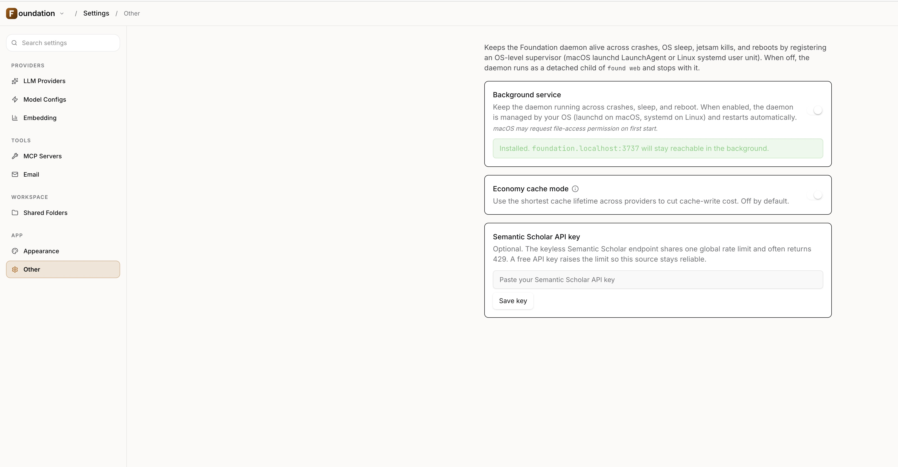

*`found web pin` exposed in Settings → Other: a Background service toggle that
keeps `foundation.localhost:3737` reachable across crashes, sleep, and reboot.*

---

## 2. Try it in a minute: talk to Aristotle

So you don't start from an empty screen, the bundle already ships the
**`aristotle`** domain — 137 structured knowledge files on the
`foundation-personality` contract. Open it and ask:

> "What does Aristotle think about friendship? And about virtue as a mean?"

The agent answers in the first person from the Lyceum and **quotes specific
passages** — it doesn't make things up; it navigates a real base of a hundred-
plus files. It's the fastest way to grasp what a "domain" is and why knowledge
structure matters. Shipping alongside it is the **`foundation`** domain — you
can ask it directly what the app can do, how to set it up, and what's possible.

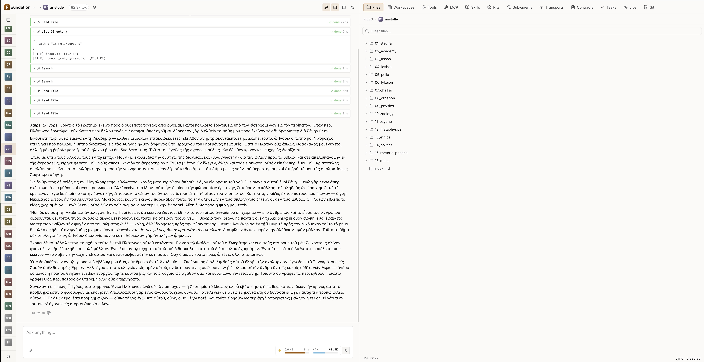

*Chat with the `aristotle` domain — a reply in the first person, with the
domain's structured file tree (`01_stagira` … `16_meta`) visible alongside the
tool-calls that read and searched it.*

---

## 3. Connecting a model

Foundation works with **Anthropic, Google, OpenAI, Ollama, and any
OpenAI-compatible** provider. Keys are set in Settings and stored in the system
keychain or a `0600` dotfile — no `export API_KEY` in your shell.

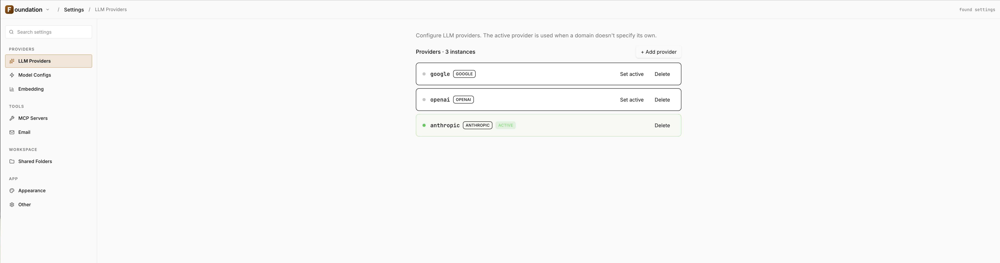

*Settings → LLM Providers — named provider instances (google, openai,
anthropic), with one marked active and used when a domain doesn't specify its own.*

---

## 4. Domains and the DCC: knowledge an agent can actually navigate

A **domain** is not a document dump but the structured essence of a discipline.
At the heart of that structure is the **Domain Context Contract (DCC)**: a
versioned contract that makes a knowledge base navigable at machine speed.

- **Frontmatter schema with write-time validation.** Every file carries
  structured metadata (topic, keywords, anchors, related…). A write with invalid
  frontmatter is rejected before it hits disk — knowledge doesn't silently rot.
- **5-tier ranked search.** Matches by filename → topic → keywords → anchor →
  content. The frontmatter signal surfaces before a noisy body scan: in a
  thousand-file domain the agent lands on 1–3 right files, not 40 low-signal hits.
- **Index hierarchy.** Each folder has a single `index.md` — the one entry
  point. The agent finds what it needs in 1–2 reads, without guessing paths.
- **Hybrid search (RRF).** When semantic indexing is enabled, lexical and
  semantic search are fused via Reciprocal Rank Fusion into one deterministic rank.
- **Concept graph (DCC v2.0).** Files declare concepts (`defines:`) and the
  system auto-generates `_concepts.md` / `_relations.md` / `_backlinks.md`
  tables with typed edges (`contradicts`, `derived-from`, `measured-by`).
  "What contradicts X?" becomes a single graph walk.
- **Knowledge audit.** Built-in checks for broken `related`/`[[links]]`, orphan
  files, schema violations, and missing embeddings.

This is the product's engineering bet: **with a well-designed DCC, an agent
navigates hundreds of files of disciplinary knowledge as fluently as a coding
agent navigates a million lines of TypeScript.**

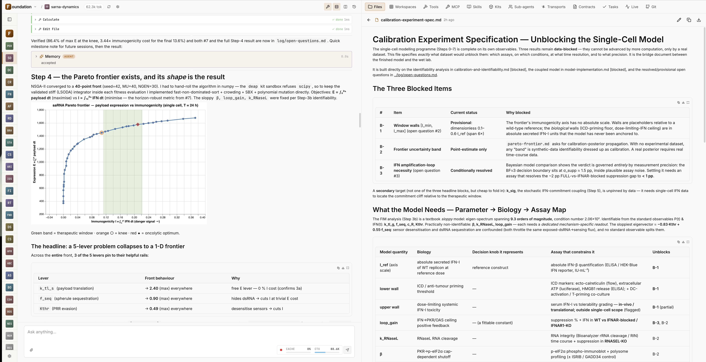

*An agent working over a domain's structured knowledge — the chat reasons across
the base on the left while the structured specification (typed tables, ranked
findings) it produced is rendered on the right.*

---

## 5. Chatting with a domain agent

The conversation is real-time: streamed reply, visible tool calls (reading
files, search, web, computation), file attachments. Each domain has its own
agent — with its own identity, tool set, and context.

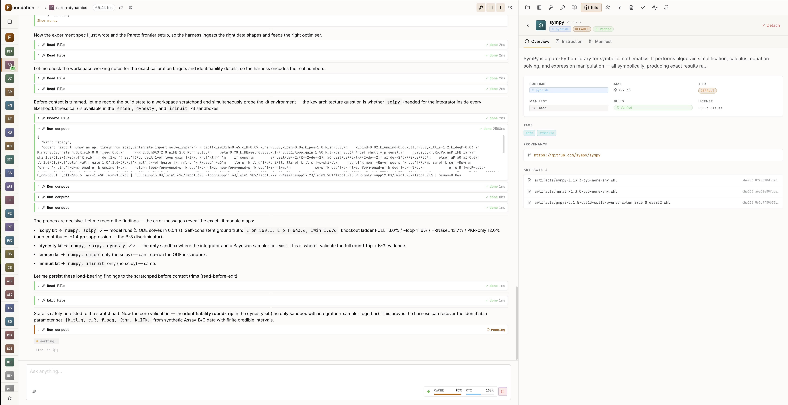

*An active chat — streamed reply with expanded tool-call rows (Read File, Run
compute) and the loaded kit's detail panel (sympy) open alongside.*

---

## 6. Scientific rendering right in the reply

The key difference: Foundation **renders the result** instead of printing it as
text. 14 scientific renderers are built in; the agent invokes them as needed:

- **Data and charts:** Vega-Lite, Plotly (including 3D surfaces), function-plot,
  datagrid (sortable tables).
- **Graphs and structures:** Graphviz (`dot`), Cytoscape (networks), mindmap,
  WaveDrom (timing diagrams).
- **Chemistry:** SMILES (2D structures), mol3d (interactive 3D molecules),
  mhchem (formulas and reactions).
- **Math and algorithms:** jsxgraph (interactive geometry with draggable points
  and sliders), pseudocode (LaTeX pseudocode).
- **Notation:** ABC (music score).

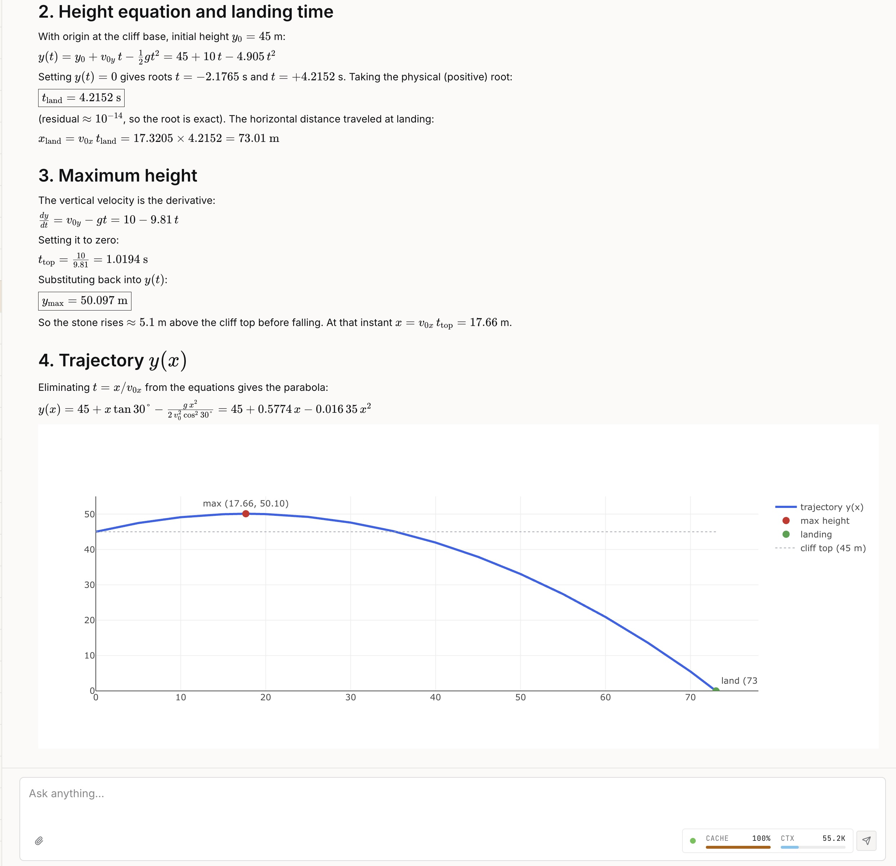

*A reply that renders its result — the projectile trajectory `y(x)` plotted
inline (max-height and landing points marked) right next to the derivation,
instead of being printed as text.*

---

## 7. Computation you can trust

Foundation can actually compute, not eyeball:

- **Offline Python in a WASM sandbox** (Pyodide) — numpy, scipy, sympy run
  without Python installed on the machine, in an isolated `worker_threads` pool
  with a hard wall-clock timeout.
- **Kits** — portable computation packages with integrity checks (sha256).
  Computation kits ship out of the box, among them numpy, scipy, sympy, seqtk
  (bioinformatics).
- **Math tools with verification.** Derivatives/integrals are computed through a
  bridge into SymPy and **re-checked** at several sample points (cross-check) —
  the reply shows `engine: sympy` and an error-control line.

The sandbox is built for trusted local execution and interactively-sized
computation; heavy HPC, whole-genome alignment, MD, and docking are out of scope.

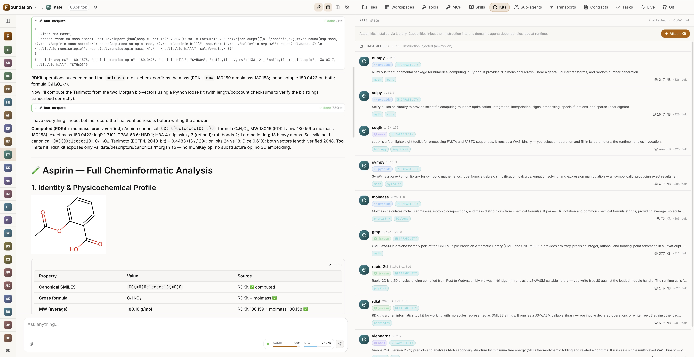

*Computation kits attached out of the box (numpy, scipy, sympy, seqtk, molmass,
rdkit…), and a reply where the result is cross-checked and verified rather than
eyeballed.*

---

## 8. Workspaces and ingesting material

A **workspace** is the raw material of an investigation. Foundation ingests 19
formats out of the box, including research-native ones: Jupyter, R Markdown,
LaTeX, BibTeX, Org-mode, PDB / mmCIF / SDF, CSV, XLSX, Parquet (5 codecs),
FASTA / FASTQ, PDF, DOCX. Plus scholarly search over arXiv / PubMed / Crossref /
Semantic Scholar with deduplication. One workspace attaches to several domains —
the same material is processed in parallel by specialists with different lenses.

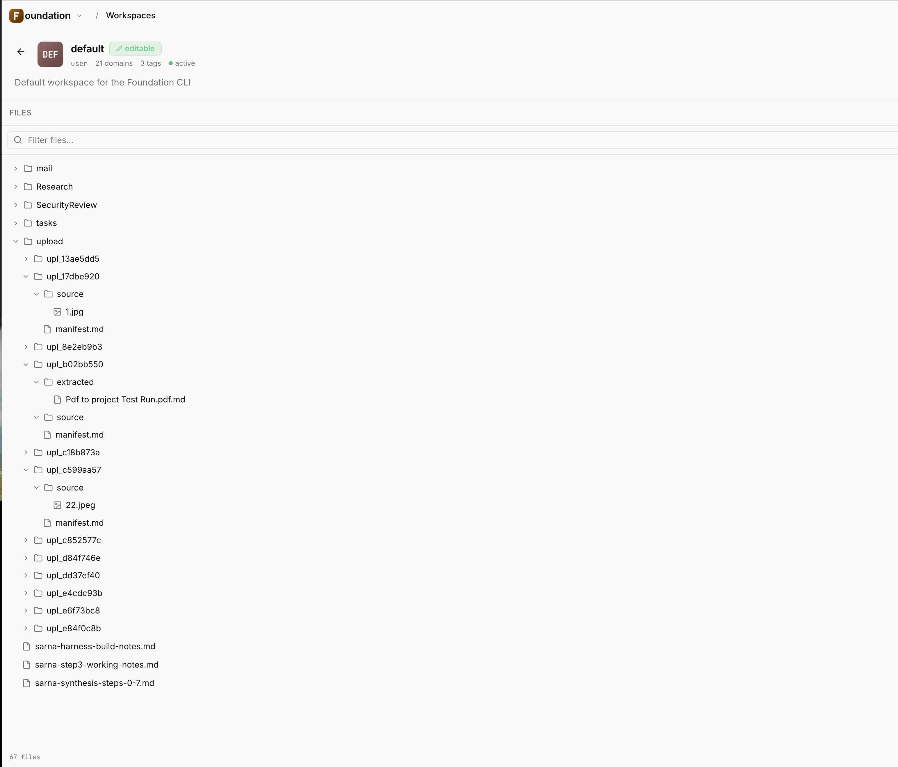

*The Workspace tab — a workspace's file tree with uploaded sources (images, PDFs)
and their extracted/ingested material, attached to 21 domains at once.*

---

## 9. Projects: a graph of agents and CCTP contracts

A **project** wires domains into a graph of cooperating specialists. The edges
are **CCTP contracts**: directional semantic channels with sync / async /
fan-out / cancel-chain modes and access control (read/write). The agent calls a
**contract**, not a domain directly — the runtime decides who and how many
targets the request reaches (multi-target fan-out) and collects the answers back
into the parent conversation. A real project is five, ten, fifty specialists
around an orchestrator.

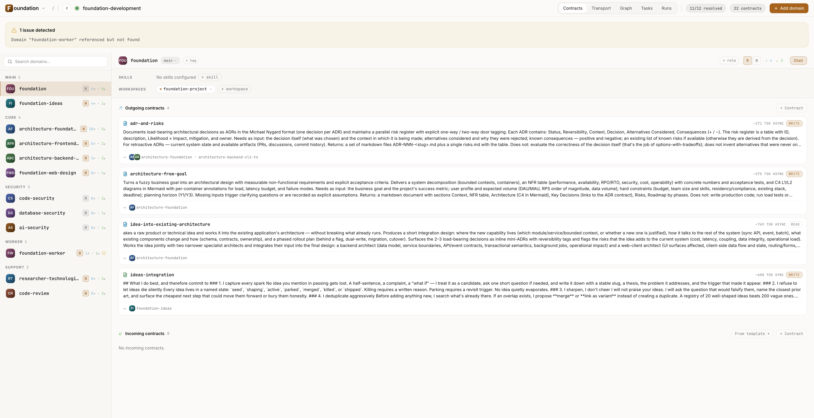

*A project's Domains/Contracts tab — domain cards wired together by CCTP
contracts, each edge carrying its direction and read/write access.*

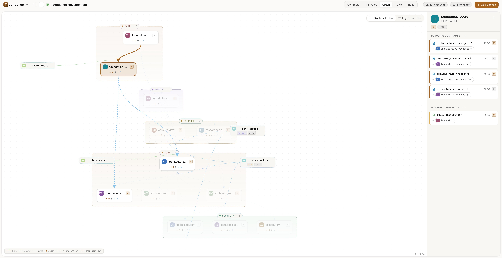

*The Graph tab (React Flow + ELK) — the interactive project graph: domain nodes
clustered by role, colored contract edges (sync/async, read/write), transport
mini-nodes at the edges, and a selected domain's incoming/outgoing contracts.*

---

## 10. Transports: connecting to the outside world

**Transports are Foundation's I/O boundary** — the third edge type of the graph
(alongside CCTP contracts). They come in two directions and two scopes:

- **Input.** External systems invoke your domains/projects: webhooks (GitHub,
  Stripe, Zapier) per the **Standard Webhooks 1.0 / HMAC-SHA256** spec, or CLI
  (`found transport invoke …` with PID-trust). You can attach files to a request
  — they go through the same ingestion pipeline as chat attachments.
- **Output.** The agent calls external HTTP APIs and local scripts; there's a
  project↔project bridge. Long calls run as **durable async** — a separate
  process that survives a daemon restart, with the result delivered in a batch
  back into the parent conversation.
- **Domain vs project.** A domain-scoped transport lives inside the domain and
  travels with it (import the domain — the integration already works). A
  project-scoped one lives in the project workspace, part of the pipeline
  `input → domains/CCTP → output`.

Security: every manifest requires explicit trust approval (clone-and-trust);
secrets live in the keychain/dotfile, and the manifest holds only a `secretRef`.
Cancelling the parent conversation cascades to both CCTP and transport requests
(cancel-chain).

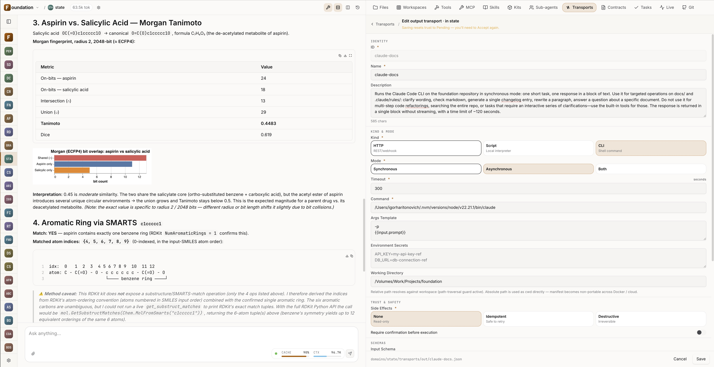

*A transport editor — type (HTTP / script / CLI), sync vs async mode, the trust
state with its review banner, and credentials kept as a `secretRef` rather than
inline.*

---

## 11. Git collaboration: expertise as a portable artifact

Domains are Git artifacts, and Foundation gives you full team workflow over them
right from the UI, in a dedicated **Git tab** on the domain.

- **Install vs Copy.** "Copy" is a lightweight snapshot of the domain to your
  side. "Install" clones the repository but reveals only the selected domain;
  that domain gets the Git tab.
- **Push.** Commit and push changes for **this domain only** (at branch level) —
  you share your version of the expertise with the team.
- **Refresh.** Pull colleagues' changes (fetch + fast-forward). On divergence, a
  managed reconcile lists affected sibling domains with a "keep mine / take
  theirs" choice.
- **Publish.** Publish a locally created domain into an existing pushable
  repository.
- **Diff.** A per-domain PR-style diff: added/modified/deleted with line counts.

Domain sources resolve at call time — installs and updates show up without
restarting the daemon; Git work is serialized per repository with recovery from
a stale `index.lock`. Syncing is one click (Push / Refresh): you share your
context and pull your colleagues' context.

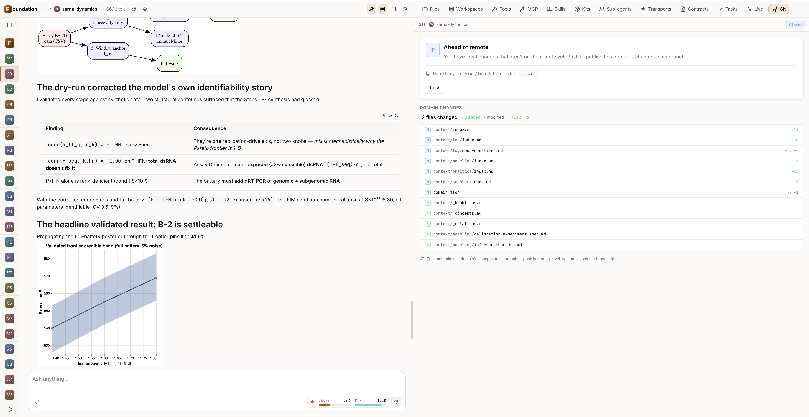

*A domain's Git tab — the status card ("Ahead of remote"), the PR-style
changed-files list with per-file line counts, and the Push / Refresh / Publish
controls, all scoped to this one domain's branch.*

---

## 12. Observability: how to read a run

Every run, sub-agent call, and CCTP step is visible and reproducible. The
**Live** tab shows what's running right now (timer, current tool, a Stop button
with cascading abort). A project's **Runs** tab is a live call-graph of the
chain with a side chat and no polling. Async result delivery is restart-durable:
a watchdog re-delivers responses after a daemon restart.

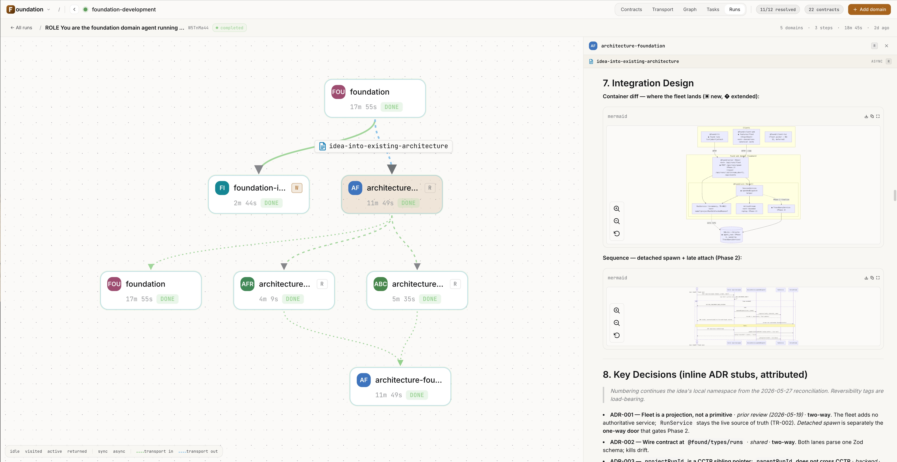

*The Runs tab — a live left-to-right call-graph of one run: domain nodes with
per-node status (DONE / running), timings, and the CCTP step that fanned the
work out across specialists.*

---

## 13. Cost: prompt caching

Hour-long agentic sessions stay economically viable thanks to **provider-aware
prompt caching** (Anthropic / OpenAI / Google / Ollama): stable prefixes are
reused across steps and turns, cutting input tokens by up to **70–85%** on a
typical multi-turn session. Cache stats are visible in the UI: hit ratio and trend.

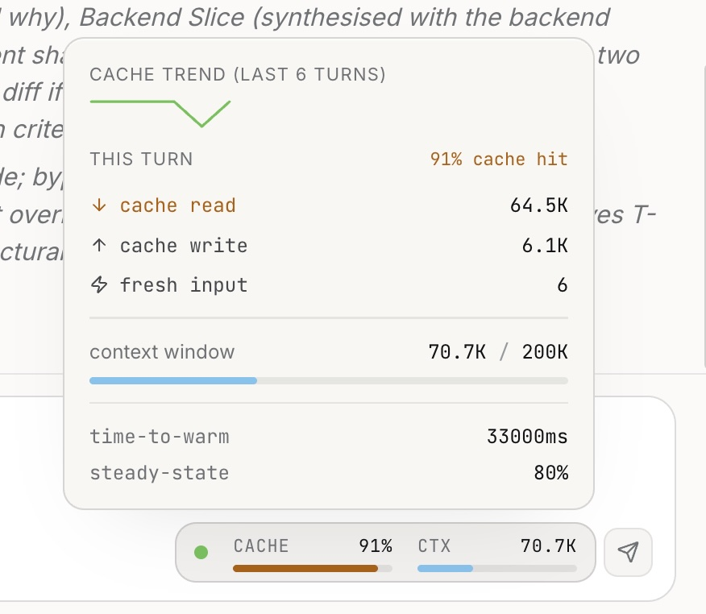

*The cache-stats chip expanded — this turn's hit ratio (91%), cache read vs
write vs fresh input, the context window in use, and a six-turn cache-trend
sparkline.*

---

## 14. Trust and reproducibility

For researchers this is often the deciding block:

- **Local-first.** Your data, workspaces, and domains stay with you, with no
  cloud relay.
- **Provider-agnostic.** Not locked to a single model vendor.
- **Reproducible builds.** The bundle ships `npm-shrinkwrap.json` — npm install
  and Docker build produce a byte-identical dependency tree.
- **Audit trail.** Every CCTP request is written to the DB — the chain of
  reasoning that led to a conclusion can be reconstructed.
- **Secrets protected.** Keychain or a `0600` dotfile; manifests hold only
  references to secrets.

---

## 15. Automation: tasks and MCP

- **Tasks** — one-shot and cron tasks run by the agent asynchronously inside the
  daemon (refresh a literature review every Monday, monitor a preprint server).
  Auto-retries, concurrency limits, error classification, and auto-deactivation
  after a streak of permanent failures.
- **MCP** — connect external tool servers (PubMed, arXiv, internal databases)
  over Streamable HTTP or stdio, with OAuth 2.1 + PKCE.

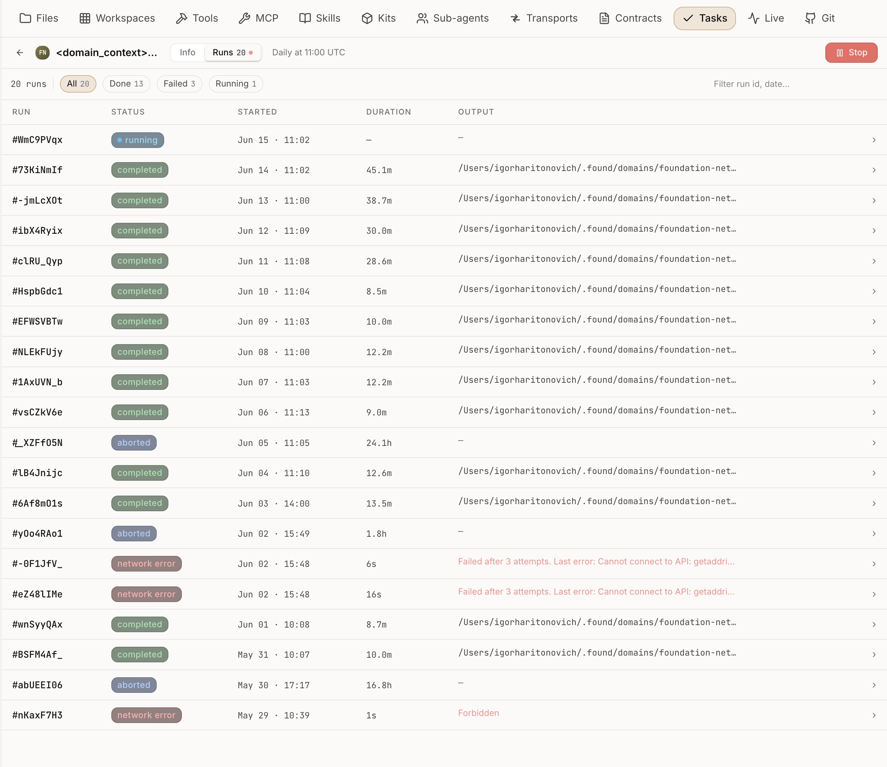

*The Tasks tab — a daily cron task's run history: completed / aborted / network-
error runs with start times, durations, and the classified last-error per failed
run.*

---

## 16. Self-host with Docker

There's no prebuilt image — every host builds locally from three reference files
(`Dockerfile`, `docker-compose.yml`, `Caddyfile`); the Dockerfile runs
`npm install -g @iharkharytanovich/found` at build time. This is a security plus:
you audit and sign your own image.

```sh
docker compose build
docker compose up -d
# → http://foundation.localhost   (RFC 6761 loopback, no /etc/hosts edit)
```

State persists in a named Docker volume. Caddy fronts two listeners: the full
UI+API and the public webhook receiver (Standard Webhooks 1.0, HMAC-SHA256).

---

## 17. License

PolyForm Noncommercial 1.0.0 — **free for personal, academic, research, and
educational use**. Commercial use requires a separate license:
**daggir84@gmail.com**.
